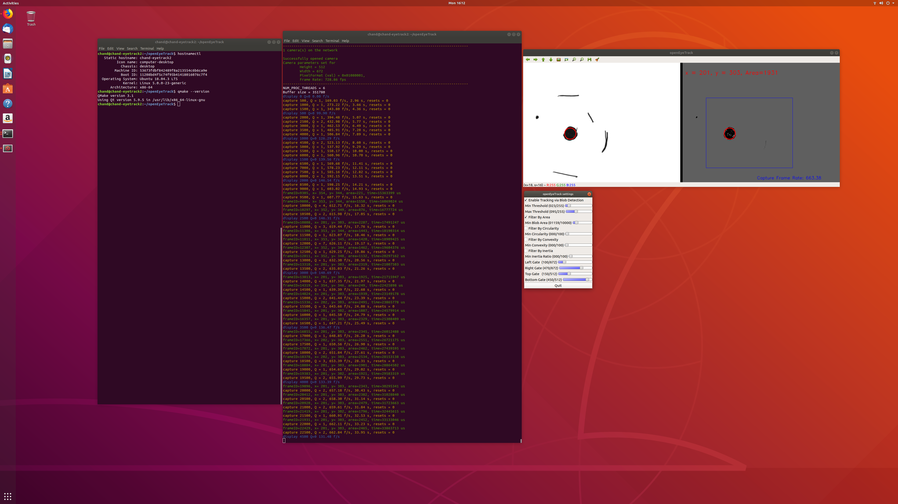

# openEyeTrack

[](https://doi.org/10.5281/zenodo.3515534)

The paper detailing our architecture is available at [](https://doi.org/10.21105/joss.01631)

## Statement of Need
When faced with a decision, an organism uses information gathered by its senses in order to determine the best course of action. Vision is one of the primary senses, and tracking eye gaze can offer insight into the cues that affect decision-making behavior. Thus, to study decision-making and other cognitive processes, it is fundamentally necessary to track eye position accurately. However, commercial eye trackers are 1) often very expensive, and 2) incorporate proprietary software to detect the movement of the eye. Closed source solutions limit the researcher’s ability to be fully informed regarding the algorithms used to track the eye and to incorporate modifications tailored to their needs. Here, we present our software solution, openEyeTrack, a low-cost, high-speed, low-latency, open-source video-based eye tracker. Video-based eye trackers can perform nearly as well as classical scleral search coil methods and are suitable for most applications.

## Software and Hardware components
openEyeTrack is a video-based eye-tracker that takes advantage of OpenCV, a low-cost, high-speed infrared camera and GigE-V APIs for Linux provided by Teledyne DALSA, the graphical user interface toolkit QT5 and cvui, the OpenCV based GUI. All of the software components are freely available. The only costs are from the hardware components such as the camera (Genie Nano M640 NIR, Teledyne DALSA, ~$450, ~730 frames per second) and infrared light source, an articulated arm to position the camera (Manfrotto: $130), a computer with one or more gigabit network interface cards, and a power over ethernet switch to power and receive data from the camera.

By using the GigE-V Framework to capture the frames from the DALSA camera and the OpenCV simple blob detector, openEyeTrack can accurately estimate the position and area of the pupil. We include pupil size calculations because of its putative link to arousal levels and emotions of the subject.


## Tested Hardware Specs
- Computer: Intel(R) Core(TM) i7-5820K CPU @ 3.30GHz, 64GB
 - Basic IR light source
     - We use this one from Amazon [IR illuminator](https://www.amazon.com/gp/product/B07Q86153D/ref=ppx_yo_dt_b_asin_title_o05_s00?ie=UTF8&psc=1)
 - Camera: [Teledyne DALSA Genie Nano M640 NIR](https://www.teledynedalsa.com/en/products/imaging/cameras/genie-nano-1gige/)
 - Netgear Power-Over-Ethernet Switch
 
Update 9/1/2020 - The camera firmware that was used can be found [here](https://github.com/chand-lab/openEyeTrack/blob/master/Camera%20Firmware/T_Nano-M640-NIR_Default_Default.ccf). You will need the windows saperea LT SDK to load it onto the camera and then set the camera to autoboot into this configuration.

Update - We have now tested the openEyeTrack implementation on an INTEL NUC i7 as well as a Zotac EN51050. The eye tracker can perform with these configurations as well. The gev_nettweak tool needs to be run to get consistent performance. The network card is otherwise overloaded and frames are lost. A 725 Hz camera at 672x512 is transmitting ~249 megabytes per second. The net tweak tool changes the size of the buffers allowing jumbo frames to be transmitted over the network. 

## Software Specs
- Ubuntu 16.04
- OpenCV 4.1.0
- Qt 5.5.1
- [GigE-V Framework for Linux](https://www.teledynedalsa.com/en/products/imaging/vision-software/linux-gige-v-framework/)
- Git
- [cvui framework](https://github.com/Dovyski/cvui)

Update 10/07/2019 : _We have tested openEyeTrack on clean installs of 18.04, and 19.04. We do not support Windows at the moment. If possible, we recommend using a clean system for openEyeTrack._ 

Update 10/07/2019 : The exact Qt version is not an issue. We find the default Qt installed with qt5-default in the install script works perfectly fine with openEyeTrack.




## Installation

 - Install git by typing: $ sudo apt-get install git-core
 - Clone repository by typing: $ git clone https://github.com/chand-lab/openEyeTrack.git
 - After installing the GigE-V Framework, you can either manually set up Qt and OpenCV or run the installation script denoted as *softwareInstall* within the repository
   - If you choose to run the installation script you may need to first convert it to an executable by typing: $ chmod +x softwareInstall.sh
   - Occassionally, you may be prompted to press "y" to continue the installation process
   - Please explicitly run the last two commands at the bottom of this file concerning linking of libraries and make sure Ubuntu actually identifies where your libraries are.

### Installing GigE-V Framework
- Go to Teledyne dalsa website and download the GigE-V Framework for Linux under support → downloads → SDKs
- Install all prerequisites listed in User Manual (GNU make can be installed through build-essential and libX11-dev should be libx11-dev)
- Unpack the .tar file in downloads and then go inside the newly created directory and copy the .tar file that looks like GigE-V-Framework_**x86**_2.02.0.0132.tar.gz to $HOME
- Cd into home and unpack tar file (use tar -zxf)
- Cd into DALSA and type $ ./corinstall
- Go to connection settings and edit the ethernet connection that is associated with the camera
- Go to the IPv4 settings and change the method to “Link-Local Only” and save changes
- Make sure the connection is enabled and verify you can connect to camera by going to terminal and typing:$ GigeDeviceStatus 
- Try running the genicam_cpp_demo found under DALSA/GigeV/examples
  - Running the demo 
- ***run the gev_nettweak tool (found under GigeV/bin) to enhance performance and prevent resetting the image transfer.***
This tool needs to be re-run if the system restarts

### Installing Qt 5.5.1
    sudo apt-get install build-essential
    sudo apt-get install qt5-default

### Installing opencv (version 4.1.0)
Navigate to the directory where you want to clone the repository
Type:

    sudo apt -y update
    sudo apt -y upgrade
    sudo apt -y remove x264 libx264-dev

Install dependencies
```
    sudo apt -y install build-essential checkinstall cmake pkg-config yasm
    sudo apt -y install git gfortran
    sudo apt -y install libjpeg8-dev libjasper-dev libpng12-dev
    sudo apt -y install libtiff5-dev
    sudo apt -y install libtiff-dev
    sudo apt -y install libavcodec-dev libavformat-dev libswscale-dev libdc1394-22-dev
    sudo apt -y install libxine2-dev libv4l-dev
    sudo apt -y install libgstreamer0.10-dev libgstreamer-plugins-base0.10-dev
    sudo apt -y install libgtk2.0-dev libtbb-dev qt5-default
    sudo apt -y install libatlas-base-dev
    sudo apt -y install libfaac-dev libmp3lame-dev libtheora-dev
    sudo apt -y install libvorbis-dev libxvidcore-dev
    sudo apt -y install libopencore-amrnb-dev libopencore-amrwb-dev
    sudo apt -y install libavresample-dev
    sudo apt -y install x264 v4l-utils
``` 
Optional dependencies

    sudo apt -y install libprotobuf-dev protobuf-compiler
    sudo apt -y install libgoogle-glog-dev libgflags-dev
    sudo apt -y install libgphoto2-dev libeigen3-dev libhdf5-dev doxygen

Clone opencv and opencv_contrib

    git clone https://github.com/opencv/opencv.git
    cd opencv
    git checkout 4.1.0
    cd ..
    git clone https://github.com/opencv/opencv_contrib.git
    cd opencv_contrib
    git checkout 4.1.0
    cd ..

 (Need to clone the same version of opencv_contrib)
 
 Make a build directory within opencv and start compilation process
 
    cd opencv
    mkdir build
    cd build
    
 Use:
 ```
 cmake -D CMAKE_BUILD_TYPE=RELEASE -D CMAKE_INSTALL_PREFIX=/usr/local 
 -D WITH_TBB=ON 
 -D WITH_V4L=ON 
 -D WITH_QT=ON 
 -D WITH_OPENGL=ON 
 -D OPENCV_EXTRA_MODULES_PATH=../../opencv_contrib/modules 
 -D BUILD_EXAMPLES=OFF 
 -D OPENCV_GENERATE_PKGCONFIG=ON ..
```
(For later versions of OpenCV, need to include OPENCV_GENERATE_PKGCONFIG=ON)

Use:  

    sudo make install -j4
(having the ‘-j4’ says to use use multiple threads which greatly speeds up this step)

**Then type:**

    sudo sh -c 'echo "/usr/local/lib" >> /etc/ld.so.conf.d/opencv.conf'
    sudo ldconfig

For detailed usage examples, see [USAGE.md](usage/USAGE.md) found under the docs folder


# Usage notes for Genie Nano Cameras

Apparently the default specs are set to be 30 Hz which would be suboptimal. In the firmware folder, we provide a firmware that enables high frame rate eye tracking. 
